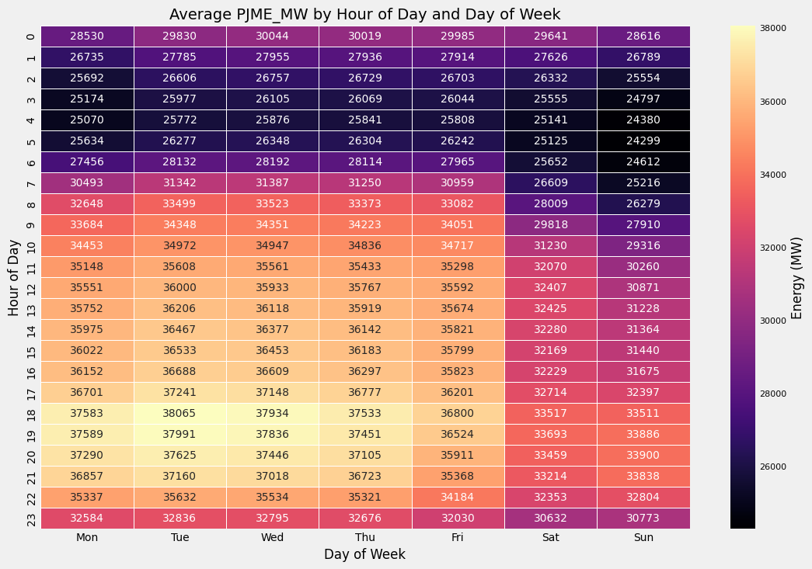
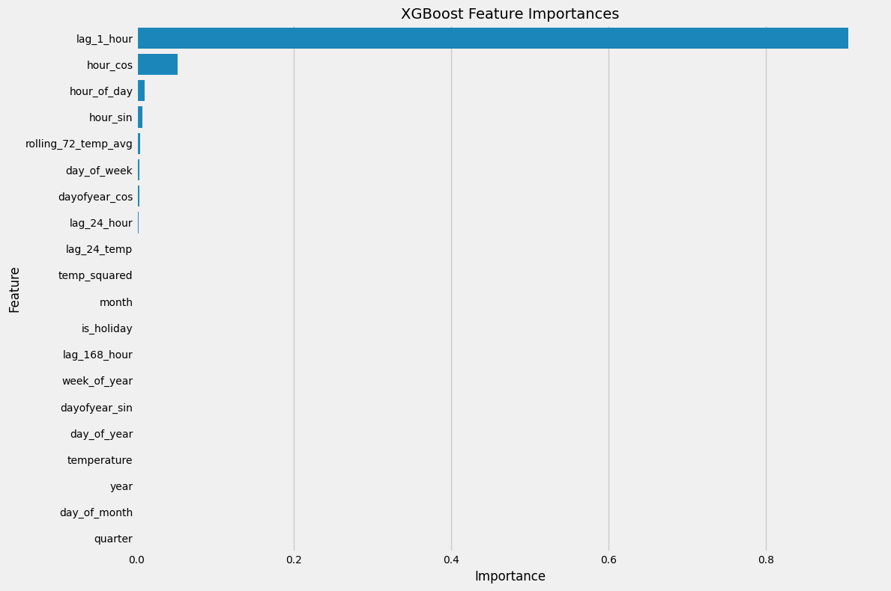
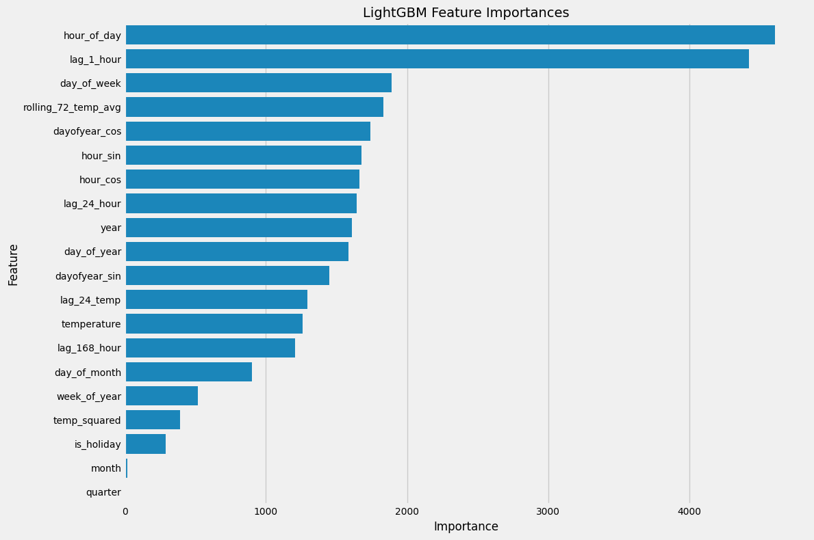

# Project: PJME Hourly Energy Consumption

This project focuses on building a robust machine learning model to predict hourly electricity demand for the PJM Interconnection, a major wholesale electricity market in the United States. Accurate energy forecasting is critical for optimising power generation, managing grid stability, planning resource allocation, and ensuring efficient energy market operations.

Using historical data, this project aims to identify key drivers of consumption patterns, including temporal features and external factors such as temperature, and ultimately deploy machine learning models to provide reliable future demand predictions. The final model demonstrates strong capabilities in capturing complex seasonal patterns and trends in energy consumption time series.

# Motivation

The ability to accurately forecast energy demande is a cornerstone of modern energy management. Underestimating demand can lead to costly power outages and economic losses, while overestimating it results in wasted resources and increased operational costs. With the increasing integration of intermittent renewable energy sources and the volatility introduced by climate change, the need for precise and agile forecasting models has never been greater.

I am undertaking this project to deepen my practical skills in time series analysis, master advanced feature engineering techniques for temporal data, and apply powerful machine learning algorithms to a real-world problem with significant societal and economic impact. This endeavour allows me to explore how data science can contribute to more sustainable and efficient energy systems.

# Dataset

The primary dataset used in this project is the **PJME Hourly Energy Consumption**. It comprises historical hourly electricity demand (measured in Megawatts - MW) for the PJM Interconnection, covering the period of 01 January 2002, 01:00 am to 03 August 2018, 12:00 am.

* **Source: [Kaggle - PJME Hourly Energy Consumption](https://www.kaggle.com/datasets/robikscube/hourly-energy-consumption)

External temperature data is also fetched from the Open-Meteo API.

# Project Structure
- `energy-prediction.ipynb`: Jupyter Notebook containing the data loading, exploratory data analysis (EDA), model building, and evaluation steps.
- `requirements.txt`: Lists all the Python libraries and their versions required to run this project.

# How to Run the Project
1. **Clone the Repository:**
   ```bash
   git clone https://github.com/lorettayong/energy-consumption-prediction.git
   cd energy-consumption-prediction
   ```

2. **Create and Activate a Virtual Environment:**
   ```bash
   python -m venv venv
   # On Windows: .\venv\Scripts\activate
   # On macOS/Linux: source venv/bin/activate
   ```
3. **Install Dependencies:**
   ```bash
   pip install -r requirements.txt
   ```
   *Generate this file from your active `venv` after installing all libraries: `pip freeze > requirements.txt`)*

4. **Download the Dataset:** Download the `PJME_hourly.csv` file from the [Kaggle - PJME Hourly Energy Consumption](https://www.kaggle.com/datasets/robikscube/hourly-energy-consumption) and place it into the `data/` directory within the cloned repository.
  
5. **Run Jupyter Notebook:**
   ```bash
   jupyter lab
   ```
   Open the `energy_prediction_pipeline.ipynb` notebook and run all cells sequentially to execute the entire machine learning pipeline from data loading to model evaluation.

# Initial Data Overview

This dataset provides a long, high-frequency time series ideal for identifying seasonal patterns (daily, weekly, annual) and long-term trends essential for comprehensive energy forecasting.

* **Columns:**
  * `Datetime`: Timestamp of the hourly record
  * `PJME_MW`: Actual hourly electricity consumption in MW.

# Project Phases

## Phase 1: Data Preprocessing and Exploratory Data Analysis (EDA)
* **Objectives:** Load the dataset, understand its structure and content, handle initial data quality issues, convert the timestamp to the correct format, and perform some initial visualisations to gain insights to the energy consumption patterns.
* **Key Activities:**
  * Loaded `PJME_hourly.csv` file into a Pandas Dataframe.
  * Conducted initial checks using `df.head()`, `df.info()`, and `df.describe()` to understand the data structure, types, and basic statistics.
  * Converted the `Datetime` column from an object (string) type to a proper `datetime` object, set as the DataFrame's index, which is crucial for time series operations, and sorted the index in chronological order to ensure data integrity.
  * Identified four instances of duplicate timestamps and handled them by keeping the first occurrence to maintain uniqueness in the time series index.
  * Generated a complete, continuous hourly `DatetimeIndex` that spans the entire data range, and `re-index`ed the DataFrame to this full range by introducing explicit `NaN` values for any previously missing hours. This is needed as the dataset exhibited instances of skipped hours (e.g. 2-hour gaps), primarily due to Daylight Saving Time (DST) changes.
  * Interpolated the `NaN` values that were introduced through reindexing (to represent the skipped hours) using a linear method. This ensures a perfectly continuous and regularly spaced hourly time series, which is a prerequisite for many time series modelling techniques.
  * Plotted the `PJME_MW` consumption over the entire period and in sections of the time series (in specific month and week) to visualise long-term trends and observe granular weekly and daily seasonality more clearly.
    * 
    * 
    * 
* **Observations from EDA:**
  * Strong annual seasonality: Energy demand shows clear yearly cycles, typically peaking during summer (for air conditioning purposes) and winter (for heating purposes), with lower demands in spring and autumn.
  * Distinct weekly seasonality: Weekday consumption patterns differ significantly from weekends, with lower demands usually on Saturdays and Sundays.
  * Clear daily seasonality: Within each 24-hour cycle, consumption follows a predictable pattern, often with peaks in the mornings and evenings, and troughs in the very early hours of the morning.
  * The overall yearly trend appears relatively stable, although specific years might show minor variations.

## Phase 2: Feature Engineering
* **Objective:** Create rich predictive features from the available energy consumption data and integrate critical external information.
* **Key Activities:**
  * Extracted components from the `DatetimeIndex` such as `hour_of_day`, `day_of_week`, `week_of_year`, `month`, `quarter`, `year`, and `is_weekend` (a binary flag).
  * Generated lagged features, including `lag_1_hour`, `lag_24_hour`, `lag_168_hour`, which represent past consumption values and are highly predictive of future demand.
  * Integrated features indicating US federal public holidays, which typically exhibit distinct energy consumption patterns due to reduction in business and industrial activities.
  * Sourced and incorporated historical temperature data corresponding to a selected location within the PJM region, Chicago. These include current temperatures, potentially lagged temperatures, and various temperature-derived features such as rolling averages and squared temperatures, given the strong correlation between temperature and demand for energy.
<<<<<<< HEAD
=======
  * Visualised engineered time-based and cyclical features to gain insights into consumption patterns and trends.
    * 
    * 
    * 
    * 
* **Observations from visualisation:**
  * JME_MW over time: This plot for a specific two-year period (2016-2017) clearly illustrates the pronounced annual seasonality in energy consumption, with noticeable peaks during summer and winter months and troughs in spring and autumn. It provides a focused view of the consistent cyclical behavior of demand year-over-year within a manageable timeframe, without the overwhelming detail of the entire dataset.
  * PJME_MW by Hour of Day: This visual effectively highlights the distinct daily consumption profiles when differentiated by weekend status. Weekdays generally show higher overall demand with characteristic morning and evening peaks corresponding to typical work/business hours. In contrast, weekends exhibit significantly lower overall demand, and their daily patterns are often flatter with less pronounced peaks, reflecting reduced commercial and industrial activity.
  * PJME_MW vs Temperature: The scatter plot clearly demonstrates a non-linear, typically "U-shaped" or "V-shaped" relationship between temperature and energy demand. Demand is at its lowest within a comfortable moderate temperature range (the bottom of the "U"). As temperatures deviate from this comfort zone (becoming either very cold or very hot), energy consumption sharply increases due to the activation of heating and cooling systems, respectively.
  * Average PJME_MW by Hour of Day and Day of Week: This heatmap provides a powerful, consolidated view of combined daily and weekly energy consumption patterns. It immediately identifies periods of highest demand (typically weekday afternoons/evenings, indicating peak commercial and residential activities) and lowest demand (often early weekend mornings when activities are minimal). The intensity of the color clearly shows how consumption varies hour-by-hour across the entire week.

## Phase 3: Model Selection, Training and Optimisation
* **Objective:** Establish initial baseline performance for the energy consumption prediction model by leveraging on a foundational set of features and exploring initial model capabilities to set a benchmark for future improvements.
* **Key Activities:**
  * Employed a chronological data split to divide the dataset into training and test sets. This approach ensures that the model is always trained on historical data and evaluated on future, unseen data to provide a realistic assessment of its predictive capabilities.
    * Training set: Data from 08 January 2002 to 31 December 2016
    * Test set: Data from 01 Janaury 2017 to 03 August 2018
  * Implemented machine learning models, XGBoost (Extreme Gradient Boosting) and LightGBM (Light Gradient Boost Machine) to evaluate as baselines. These models were selected for their robust performance in tabular data and time series forecasting.
* **Initial Feature Set:** The models in this baseline phase were trained using an initial set of features primarily derived from the `Datetime` index, such as:
  * Hour of day
  * Day of week
  * Month
  * Year
  * Lag 1 Hour
  * Lag 24 Hours
* **Baseline Performance:**
  * XGBoost:*
    * RMSE: 339.45
    * MAE: 248.73
    * R-squared: 0.9969272384939307
    * 
  * LightGBM:*
    * RMSE: 335.96
    * MAE: 248.34
    * R-squared: 0.996990114808874
    * 
* **Feature Importance Insights:** An initial analysis of feature importance from the baseline models provided valuable insights into which features were most influential in predicting energy consumption:
  * Top 10 Feature Importance from Baseline XGBoost Model:
    1. lag_1_hour: 0.905533
    2. hour_cos: 0.052553
    3. hour_of_day: 0.009846
    4. hour_sin: 0.007402
    5. rolling_72_temp_avg: 0.004043
    6. day_of_week: 0.003882
    7. dayofyear_cos: 0.003802
    8. lag_24_hour: 0.002408
    9. lag_24_temp: 0.001814
    10. temp_squared: 0.001745
    * 
  * Top 10 Feature Importance from Baseline LightGBM Model:
    1. hour_of_day: 4701
    2. lag_1_hour: 4399
    3. day_of_week: 1840
    4. hour_sin: 1781
    5. rolling_72_temp_avg: 1778
    6. dayofyear_cos: 1721
    7. year: 1639
    8. hour_cos: 1618
    9. lag_24_hour: 1593
    10. day_of_year: 1557
    * 
**Key takeaways from Feature Importance:**

The immediate previous hour's consumption (`lag_1_hour`) is clearly the most dominant feature for both models, underscoring the strong autocorrelation in energy demand.

Features related to the hour of the day, such as `hour_of_day`, `hour_sin` and `hour_cos`, are also consistently ranked high, thus confirming the critical role that daily patterns play in energy consumption predictions.

Despite being newly integrated, temperature-based features like `rolling_72_temp_avg`, `lag_24_temp`, and `temp_squared` have quickly proven their values, indicating temperature to be a crucial external driver of energy demand.

<<<<<<< HEAD
=======
## Phase 4: Advanced Feature Engineering
* **Objective:** Capture more nuanced, complex, and high-impact relationships within the energy consumption data by engineering sophisticated features, with the aim of providing the predictive model with a richer understanding of demand drivers beyond basic time-series components and leading to improved accuracy and robustness.
* **Key Activities:**
  * Engineered sophisticated temperature-based features, including Heating Degree Days (`HDD`) and Cooling Degree Days (`CDD`), to model the threshold-dependent impact of temperature on heating and cooling demand.
  * Calculated rolling means (e.g. `PJME_MW_rolling_24_hr_mean`) to smooth out short-term noise and reveal underlying trends, and rolling standard deviations (e.g. `PJME_MW_rolling_24_hr_std`) to quantify and identify periods of increased volatility or variability in energy demand.
  * Constructed novel interaction features by multiplying existing variables (e.g. `hour_of_day_x_is_weekend`). This allowed for modeling conditional relationships, where the effect of one variable on energy demand depends on the state of another.
  * Created comprehensive visualisations for these newly engineered features to visually confirm patterns, assess relationships with energy demand, and gain deeper insights into complex demand drivers.
    * 
    * 
    * 
    * 
    * 
    * 
* **Observations from visualisation:**
  * PJME_MW vs Heating Degree Days (HDD): There is a clear positive linear relationship between Heating Degree Days (HDD) and energy consumption. As HDD values increase (due to colder temperatures and greater heating needs), PJME_MW demand also tends to increase significantly, indicating a strong correlation.
  * PJME_MW vs Cooling Degree Days (CDD): Similar to HDD, there's a strong positive linear relationship between CDD and PJME_MW. As CDD values rise (indicating hotter temperatures and greater cooling needs), energy demand generally increases sharply. This correlation is often even stronger than with HDD in some regions.
  * PJME_MW vs 24-Hour Rolling Mean: The 24-hour rolling mean effectively smooths out short-term fluctuations in the actual `PJME_MW` data. It clearly reveals the underlying daily and weekly trends, making the broader patterns and seasonality much more apparent than the raw data alone. This helps in understanding the baseline demand and its general movement.
  * PJME_MW 24-Hour Rolling Standard Deviation: This visual highlights periods of higher or lower volatility in energy demand. Peaks in the rolling standard deviation indicate times when energy consumption is more variable or fluctuating (such as during rapid weather shifts, major events, or periods of high uncertainty), while lower values suggest more stable demand.
  * PJME_MW by Is_Holiday: The boxplot distinctly shows a noticeable difference in energy consumption between holidays and non-holidays. Typically, energy demand is significantly lower on holidays as compared to regular non-holiday days, reflecting reduced business, industrial, and possibly changed residential activity.
  * PJME_MW vs CDD by Is_Weekend: Coloured by weekend status, this scatter plot reveals whether the relationship between CDD and energy consumption differs between weekdays and weekends. It is observed that there are distinct clusters or even different slopes in the data points for "No" (weekdays) versus "Yes" (weekends), indicating that cooling demand responds differently or is driven by different activity levels on those respective days.

# Next Steps (Future Work)
* ~~**Feature Engineering:** Create new predictive features from the existing `DatetimeIndex` of the energy consumption data, including the extraction of components such as hour of the day, day of the week, month, quarter, year, and the creation of flags for weekends.~~
* ~~**External Data Integration:** Source and incorporate historical temperature data corresponding to the PJM region to demonstrate the correlation between temperature and energy demand, and integrate features indicating national public holidays to exhibit distinct patterns of energy consumption.~~
* ~~**Model Building:** Select suitable regression models for time series forecasting, such as XGBoost Regressor, LightGBM Regressor, and Facebook Prophet, train these models on the prepared training data, and perform an initial evaluation of their performance using metrics like Root Mean Squared Error (RMSE), Mean Absoluate Error (MAE), and R-squared ($R^2$) on the test set.~~
* **Advanced Feature Engineering:** Build upon the initial features by creating a comprehensive set of new, highly predictive features. This includes further leveraging cyclical time-based components e.g. interaction terms, generating more sophisticated lagged values of energy consumption, and implementing various rolling window statistics for both energy consumption and external temperature data.
* **Hyperparameter Tuning & Optimisation:** Systematically tune the hyperparameters of selected regression models, XGBoost Regressor and LightGBM Regressor, using robust, time series-aware cross-validation strategies such as `TimeSeriesSplit` to achieve optimal predictive performance. This may involve using iterative search techniques or more advanced optimisation frameworks.
* **Model Evaluation:** Conduct a comprehensive final evaluation of the optimised model performances using key metrics like Root Mean Squared Error (RMSE), Mean Absolute Error (MAE), and R-squared ($R^2$) on the dedicated test set.
* **Advanced Model Exploration:** Investigate alternative time series forecasting models beyond gradient boosting, such as Ensemble Methods / Stacking or deep learning time series models like Long Short-Term Memory (LSTMs).
* **Model Deployment:** Develop a simple and interactive web application to showcase the practical accessibility of the trained forecasting model.